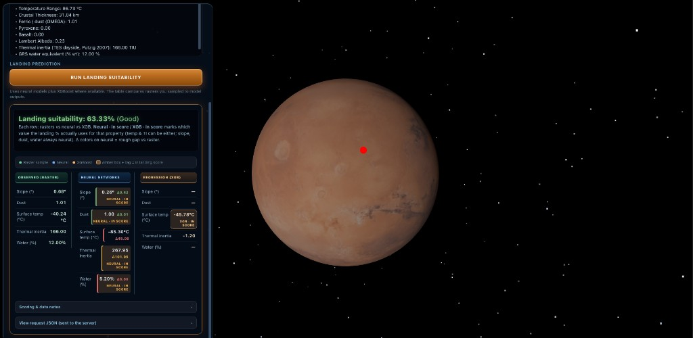

# V.A.N.G.U.A.R.D
**Visual & Analytical Navigation for Geospatial Understanding And Rover Deployment**



## Overview

Our goal is to leverage Martian geospatial data to build machine learning models that predict key surface and environmental attributes of Mars. These models aim to support the identification of interesting landing-site candidates for future missions, based on scientific and engineering-style criteria.

The **3D globe** loads **bundled GeoTIFFs** under `frontend/3d_globe/public/data/`, samples them at the clicked lat/lon, and sends those values to `POST /predict`. **Live UI path:** **GeoTIFF → JSON features → neural nets + XGB (where available) → fused properties → landing score** (`backend/scoring.py`).

## Objectives

- Collect and process Mars surface data  
- Engineer features that are relevant to mission planning  
- Train and evaluate models that predict surface attributes  
- Generalize predictions across diverse Martian terrain types  
- Identify and rank promising candidate sites for future exploration

## Features

### Machine Learning Models
- **Dust Prediction**: Predicts dust coverage on Martian surface
- **Slope Analysis**: Estimates terrain slope for landing safety
- **Surface Temperature**: Predicts surface temperature variations
- **Thermal Inertia**: Analyzes thermal properties of surface materials
- **Water Content**: Estimates water equivalent hydrogen (WEH) percentage

### 3D Visualization
- **Interactive 3D globe** (Three.js): orbit controls, optional sun lighting
- **Per-click GeoTIFF sampling**: each registered layer is read at the clicked point (elevation, slope, temperature, etc.); values appear as a text list in the side panel
- **Landing prediction panel**: after **Predict landing suitability**, shows **landing %**, a **three-column** table (**Observed (raster)** vs **Neural networks** vs **Regression (XGBoost)**), fusion footnotes, optional **Δ** badges where a raster value exists for that row, and an expandable **raw JSON** payload

### Web Interface (what the app actually shows)
- **Point-and-click** on the globe → numeric **raster-derived** properties for that location
- **One-button** call to `POST /predict` (same origin as the page when you use the Flask server below)
- **No separate charting dashboard** in the globe UI (no built-in plots); exploration is tabular / text plus the 3D view

**Observed column:** Raster values in the prediction table mirror fields in the JSON body to `/predict`. **Dust (observed)** uses the **OMEGA ferric/dust** raster (`omega_ferric_nnphs.tif`): the same sampled value is sent as **`ferric`** (model input) and duplicated as **`dustObserved`** for the table. **Slope** and **surface temperature** come from the MOLA/HRSC slope and yearly-average temperature GeoTIFFs. **Thermal inertia (observed)** is sampled from **TES dayside thermal inertia (Putzig et al. 2007)** (`tes_dayside_ti_putzig_2007.tif`); the API uses `thermalInertia` when present to choose **neural vs XGB** for the score (see fusion paragraph under **Landing Suitability Prediction**). **Water (observed)** is **Odyssey GRS** weight percent (`mars_odyssey_grs_mons_perc_wt.tif`, field `grsWaterWt`)—illustrative vs the neural water output; definitions may differ from training targets.

## 🚀 Quick Start

This project uses `uv` for dependency management. If you don't have `uv` installed, install it first:

```bash
# Install uv (if not already installed)
curl -LsSf https://astral.sh/uv/install.sh | sh
```

### Running the API

```bash
# Method 1: Using the script
./start_api.sh

# Method 2: Using uv directly
uv run python backend/app.py
```

The API will start on `http://localhost:5002` (or port 5000 if 5002 is unavailable).

Optional: for detailed server logs and per-request HTTP lines, run with `VANGUARD_VERBOSE=1` (default is a short, readable startup + one line per `/predict`).

**Recommended way to use the globe + API together:** after `./start_api.sh` (or `uv run python backend/app.py`), open **`http://127.0.0.1:5002`** (or the port printed in the terminal—**5000** if 5002 is taken). Flask serves `frontend/3d_globe/` and `POST /predict` on the **same origin**, which matches the client’s `fetch` to `/predict`.

### Running without `uv` (pip)

If you prefer not to use `uv`, you can install Python dependencies via `pip`:

```bash
python3 -m venv .venv
source .venv/bin/activate
pip install -r requirements.txt
python backend/app.py
```

### Running Individual Predictors

```bash
# Test all models
uv run python backend/scoring.py

# Run individual predictors
uv run python backend/dust_predictor.py
uv run python backend/slope_predictor.py
uv run python backend/surface_temp_predictor.py
uv run python backend/thermal_inertia_predictor.py
uv run python backend/water_predictor.py
```

## Installation

### Prerequisites

- **Python 3.11+**
- **uv** - Fast Python package installer (install with: `curl -LsSf https://astral.sh/uv/install.sh | sh`)
- **Node.js** - For frontend development

### Backend Setup

1. **Clone the repository**
   ```bash
   git clone <repository-url>
   cd VANGUARD
   ```

2. **Install dependencies with uv**
   ```bash
   uv sync
   ```
   This will automatically:
   - Create a virtual environment
   - Install all dependencies from `pyproject.toml`
   - Set up the project environment

3. **Start the API server**
   ```bash
   ./start_api.sh
   # Or manually:
   uv run python backend/app.py
   ```

### Frontend setup

**Default (no extra steps):** the backend serves the globe; see **Running the API** above.

**Optional — `live-server` only for frontend-only hacking:** the page calls **`/predict` on the same host as the page**. If you open the app on port **8080** without a proxy, `/predict` will not hit the Flask API unless you change the fetch URL or add a dev proxy. For a working predict button, prefer the **Flask URL**.

```bash
cd frontend/3d_globe
npm install
npx live-server --port=8080   # optional; wire API separately if you need predictions
```

### Demo: GeoTIFF layers sampled on click

These files (under `frontend/3d_globe/public/data/`) are registered in `frontend/3d_globe/index.js` and sampled at the clicked location:

| Layer | File (repo) |
|--------|-------------|
| Elevation (MOLA) | `MOLA_128ppd_topo.tif` |
| Slope | `mola_hrsc_blend_slope_v2.tif` |
| Roughness | `mola_roughness_0.6km_numeric.tif` |
| Albedo | `omega_albedo_r1080.tif` |
| Temperature (yearly average °C) | `mars_yearly_avg_temperature_celsius.tif` |
| Temperature range | `mars_yearly_temperature_range_v1.0.tif` |
| Crustal thickness | `mars_crustal_thickness_gmm3_rm1.tif` |
| Ferric / dust (OMEGA) | `omega_ferric_nnphs.tif` (also exposed as `dustObserved` in the API payload) |
| Pyroxene | `omega_pyroxene_bd2000.tif` |
| Basalt | `TES_Basalt_numeric.tif` |
| Lambert albedo | `TES_Lambert_Albedo_numeric.tif` |
| Thermal inertia (TES dayside, Putzig 2007) | `tes_dayside_ti_putzig_2007.tif` |
| GRS water equivalent (% wt) | `mars_odyssey_grs_mons_perc_wt.tif` |

GeoTIFF **no-data** values are respected when GDAL metadata is present so missing pixels are less likely to show as false `0.00`.

## Managing Dependencies with UV

### Basic Commands

```bash
# Install all dependencies
uv sync

# Add a new dependency
uv add package-name

# Add a development dependency
uv add --group dev package-name

# Remove a dependency
uv remove package-name

# Update all dependencies
uv sync --upgrade
```

### Development Tools

```bash
# Run code formatting
uv run black backend/

# Run linting
uv run flake8 backend/

# Run type checking
uv run mypy backend/

# Run tests
uv run pytest
```

## Project Structure

```
VANGUARD/
├── backend/                    # Python backend with ML models
│   ├── datasets/              # Mars surface data
│   ├── saved_models/          # Trained ML models
│   ├── plots/                 # Data visualizations
│   ├── dust_predictor.py      # Dust prediction model
│   ├── slope_predictor.py      # Slope prediction model
│   ├── surface_temp_predictor.py  # Surface temperature model
│   ├── thermal_inertia_predictor.py  # Thermal inertia model
│   ├── water_predictor.py     # Water content prediction model
│   ├── scoring.py             # Landing suitability scoring system
│   └── app.py                 # Flask API server
├── frontend/
│   ├── 3d_globe/              # Interactive 3D Mars visualization
├── pyproject.toml             # Project configuration and dependencies
├── uv.lock                    # Locked dependency versions
└── start_api.sh              # API startup script
```

## Usage

### API Endpoints

The Flask API provides the following endpoints:

- `POST /predict` - Get landing suitability prediction (includes all property predictions)
- `GET /health` - Check API server health and model loading status
- `GET /models` - Get information about loaded ML models

### Landing Suitability Prediction

The main endpoint runs the neural property models, runs **XGBoost** for **surface temperature** and **thermal inertia** (when model files load), **fuses** temperature and thermal inertia for scoring (see fusion paragraph below), then computes **`landing_score`** via `LandingSuitabilityScorer`.

**Request:**
```json
{
  "lat": 15.23,
  "lon": -45.67,
  "elevation": 1234.56,
  "slope": 2.34,
  "roughness": 0.89,
  "albedo": 0.15,
  "temperature": -45.23,
  "tempRange": 12.45,
  "crustalThickness": 45.67,
  "ferric": 0.23,
  "pyroxene": 0.12,
  "basalt": 0.45,
  "lambertAlbedo": 0.18,
  "thermalInertia": 412.0,
  "grsWaterWt": 2.1,
  "dustObserved": 0.23
}
```

Optional / UI-driven fields: `thermalInertia` (TES dayside Putzig 2007 raster at the click) and `grsWaterWt` (Odyssey GRS % wt) are **passed through** for the **Observed** column and `raw_mars_data`; **`thermalInertia`** is also used in **TI fusion** for the landing score when present (see below). **`grsWaterWt`** is **not** an input feature to the neural nets in the current `map_mars_data_to_features` pipeline. **`dustObserved`** duplicates the **`ferric`** sample from `omega_ferric_nnphs.tif` for display only (not a separate model feature).

**Response (illustrative numbers):**

- `predictions.neural_networks` — **fused** property bundle **used for `landing_score`** (same key name as before; not “NN-only”).
- `predictions.neural_networks_baseline` — **neural nets only** (no temperature/TI substitution from XGB).
- `predictions.regression_models` — raw XGB outputs (`surface_temp_xgb`, `thermal_inertia_xgb`).
- `raw_mars_data` — **echo of the full request JSON** the server received (not truncated in real responses).

```json
{
  "success": true,
  "landing_score": 78.5,
  "predictions": {
    "neural_networks": {
      "slope": 2.1,
      "dust": 0.15,
      "surface_temp": -42.3,
      "thermal_inertia": 450.2,
      "water": 3.5
    },
    "neural_networks_baseline": {
      "slope": 2.1,
      "dust": 0.15,
      "surface_temp": -41.0,
      "thermal_inertia": 320.0,
      "water": 3.5
    },
    "regression_models": {
      "surface_temp_xgb": -44.8,
      "thermal_inertia_xgb": 445.2
    }
  },
  "overrides_applied": {
    "surface_temp": "surface_temp_xgb",
    "thermal_inertia": "thermal_inertia_xgb"
  },
  "raw_mars_data": {
    "lat": 15.23,
    "lon": -45.67,
    "elevation": 1234.56,
    "slope": 2.34,
    "roughness": 0.89,
    "albedo": 0.15,
    "temperature": -45.23,
    "tempRange": 12.45,
    "crustalThickness": 45.67,
    "ferric": 0.23,
    "pyroxene": 0.12,
    "basalt": 0.45,
    "lambertAlbedo": 0.18,
    "thermalInertia": 412.0,
    "grsWaterWt": 2.1,
    "dustObserved": 0.23
  }
}
```

**Fusion for the landing score:** `predictions.neural_networks` is the fused bundle used by `LandingSuitabilityScorer`. For **surface temperature**, if the request includes a numeric `temperature` (raster input from the globe), the API picks **neural vs XGB** whichever is closer to that value among physically plausible predictions; if `temperature` is missing, it keeps the previous rule (prefer XGB when its prediction is in \[-200, 50\] °C). For **thermal inertia**, the same “closest to observed” rule applies when the client sends numeric **`thermalInertia`** or **`thermal_inertia`** (the bundled globe now samples **Putzig 2007 TES dayside TI** into `thermalInertia`); if neither is sent, XGB is used when its value is in \[50, 2000\], else neural. `overrides_applied` values include `surface_temp_xgb` / `surface_temp_nn` and `thermal_inertia_xgb` / `thermal_inertia_nn` to indicate which source was chosen for the score (omitted when the default path uses neural-only for that field and no explicit choice is recorded).

### Landing Score Interpretation

- **90-100%**: Excellent landing site
- **70-89%**: Good landing site
- **50-69%**: Fair landing site
- **30-49%**: Poor landing site
- **0-29%**: Very poor landing site

The scoring system is implemented in `backend/scoring.py` (`LandingSuitabilityScorer`) and is based on NASA/JPL engineering constraints. See `LANDING_SCORING_SOURCES.md` for detailed source citations.

### Example Usage

```python
import requests

# Example API call
response = requests.post('http://localhost:5002/predict', json={
    "lat": 15.23,
    "lon": -45.67,
    "elevation": 1234.56,
    "slope": 2.34,
    "roughness": 0.89,
    "albedo": 0.15,
    "temperature": -45.23,
    "tempRange": 12.45,
    "crustalThickness": 45.67,
    "ferric": 0.23,
    "pyroxene": 0.12,
    "basalt": 0.45,
    "lambertAlbedo": 0.18,
    "thermalInertia": 412.0,
    "grsWaterWt": 2.1,
    "dustObserved": 0.23,
})

result = response.json()
print(f"Landing Score: {result['landing_score']}%")
print(f"Predictions: {result['predictions']}")
```

## Data sources

- **JMARS and mission products** — Training data was extracted from [JMARS](https://jmars.asu.edu/); the demo uses bundled GeoTIFFs derived from NASA mission data products (files in `frontend/3d_globe/public/data/`; provenance per layer in the demo GeoTIFF table above).
- **Globe texture** — Mars imagery for the 3D sphere (e.g. `frontend/3d_globe/textures/`); separate from the scientific rasters used for sampling and API inputs.

## Dependencies

### Backend
- TensorFlow 2.16.2 - Machine learning framework (Linux) / tensorflow-macos (macOS)
- scikit-learn 1.7.1 - Machine learning library
- XGBoost 3.0.4 - Gradient boosting framework
- Flask 2.3.3 - Web framework
- NumPy 1.26.4 - Numerical computing
- Pandas 2.3.2 - Data analysis
- Matplotlib 3.10.6 - Plotting

All dependencies are managed through `pyproject.toml` and installed via `uv`.

### Frontend
- Three.js 0.179.1 - 3D graphics library

## Landing Site Scoring System

The landing suitability scoring system uses an expert system based on NASA/JPL engineering constraints from actual Mars mission landing site selection processes. The scoring criteria include:

- **Slope (30%)**: Critical for rover stability at touchdown
- **Dust (20%)**: Avoid dust-dominated surfaces for safe landing
- **Surface Temperature (20%)**: Thermal management constraint
- **Thermal Inertia (20%)**: Indicates surface stability and load-bearing capacity
- **Water (10%)**: Scientific interest (secondary to engineering safety)

For detailed source citations and justification, see [LANDING_SCORING_SOURCES.md](LANDING_SCORING_SOURCES.md). The API uses `LandingSuitabilityScorer` in `backend/scoring.py` to compute the `landing_score`.

## Contributors

This project is developed by:

- **Eshaan Khare** - Project Lead, System Architecture, and ML Model Development (Slope, Surface Temperature, and Thermal Inertia models)
- **Arv Jain** - Water and Dust Prediction Models

## Deployment

The stack is set up for **local or self-hosted** use: run the Flask app (`./start_api.sh` or `uv run python backend/app.py`), then open the URL it prints so the served globe and `POST /predict` share the same origin. There is no separate production deploy manifest in this repository; adapt hosting (WSGI, TLS, static assets) to your environment if you expose it beyond localhost.

## License

See [license.md](license.md) for detailed licensing information including third-party contributions and dependencies.

## Acknowledgments

- **JMARS Team**: For providing Mars surface data
- **Three.js Community**: For 3D visualization capabilities
- **Open Source ML Libraries**: TensorFlow, scikit-learn, XGBoost
- **Jared Dominguez**: Original 3D globe implementation
- **Natural Earth Data**: Geographic data sources
- **NASA/JPL**: For landing site selection criteria and engineering constraints
